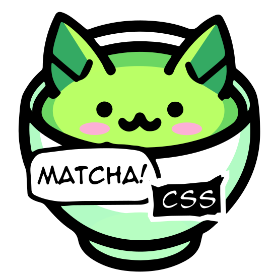

# Exploring Matcha CSS


In this project, you'll find an example HTML file that uses Matcha CSS to style a basic webpage. The page includes a header, some introductory text, a call-to-action button, and a section highlighting the features of Matcha CSS.


## Project Files

- `index.html`: The main HTML file that demonstrates how to use Matcha CSS.

## Getting Started

To view the example page, simply open the `index.html` file in a web browser. Ensure you have an internet connection to load the Matcha CSS stylesheet from the CDN.

### How to Use Matcha CSS

1. Include the Matcha CSS stylesheet in your HTML file by adding the following link tag inside the `<head>` section:
    ```html
    <link rel="stylesheet" href="https://matcha.mizu.sh/matcha.css">
    ```

2. Apply Matcha CSS classes to your HTML elements to style them. For example:
    ```html
    <button class="btn btn-primary">
        <a href="https://matcha.mizu.sh/#preview-website" style="color: white; text-decoration: none;">Learn More</a>
    </button>
    ```

## Live Demo

You can preview the example page live at [https://your-github-pages-url](https://your-github-pages-url).


